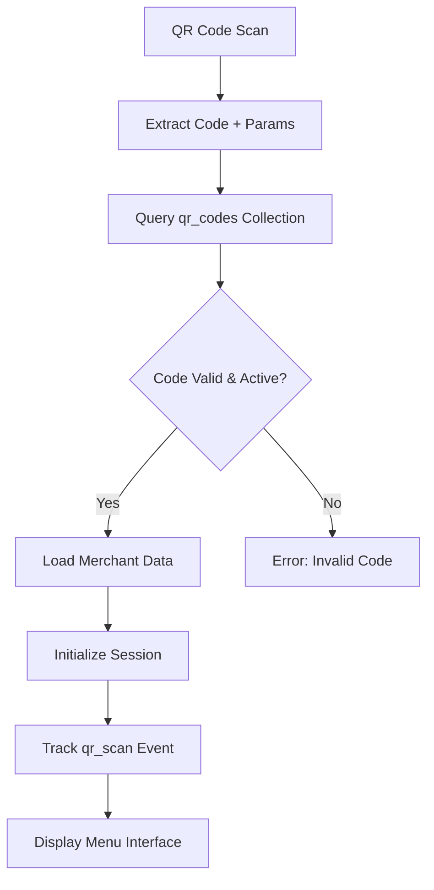
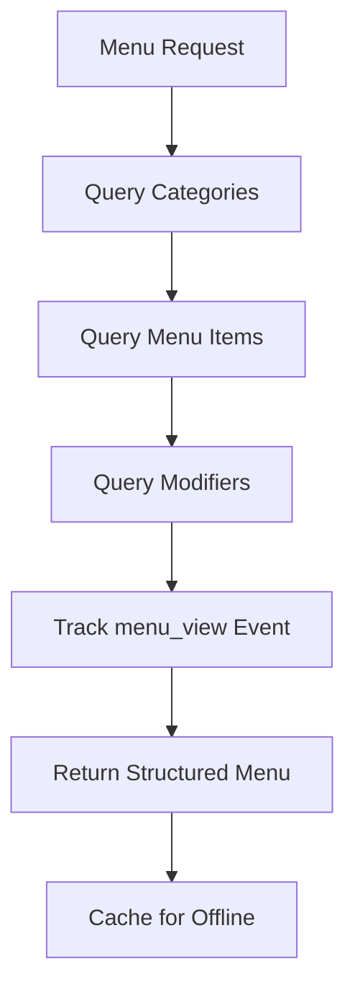
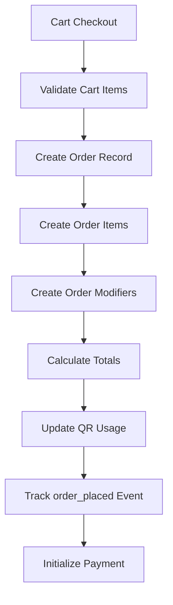

# EZOrder User App - Database Reference Guide

## Overview

This document provides a comprehensive reference for the EZOrder User App's database interactions, focusing on customer-facing workflows and data flows. The User App is a Progressive Web App (PWA) that enables contactless QR code-based ordering experiences, interfacing with the same PocketBase database as the Admin App but from a customer perspective.

## Table of Contents

1. [Customer Journey Architecture](#customer-journey-architecture)
2. [User App Data Flow](#user-app-data-flow)
3. [Customer-Centric Collections](#customer-centric-collections)
4. [QR Code & Session Management](#qr-code--session-management)
5. [Menu & Ordering Workflows](#menu--ordering-workflows)
6. [Payment Processing Flows](#payment-processing-flows)
7. [Real-time Order Tracking](#real-time-order-tracking)
8. [Customer Data Management](#customer-data-management)
9. [Analytics & Feedback](#analytics--feedback)
10. [API Endpoints](#api-endpoints)
11. [Performance Optimization](#performance-optimization)
12. [Security & Privacy](#security--privacy)

---

## Customer Journey Architecture

### Core Customer Flow
```
QR Scan → Venue Load → Menu Browse → Item Selection → Customization → 
Cart → Checkout → Payment → Order Tracking → Completion → Feedback
```

### Database Touchpoints
```
qr_codes → merchants + menu_items → orders + order_items + 
order_modifiers → payments → analytics_events → reviews + loyalty_points
```

### Session Management
- **Anonymous Sessions**: No account required for basic ordering
- **Optional Registration**: Enhanced features with customer profiles
- **Guest Orders**: Full functionality without permanent data storage

---

## User App Data Flow

### 1. QR Code Access Flow


**Database Operations:**
```sql
-- Validate QR Code
SELECT * FROM qr_codes 
WHERE code = {scanned_code} 
  AND active = true

-- Get Merchant Info
SELECT * FROM merchants 
WHERE id = {merchant_id} 
  AND status = 'active'

-- Track Access Event
INSERT INTO analytics_events 
(event_type, merchant_id, session_id, metadata)
```

### 2. Menu Loading Flow


**Database Operations:**
```sql
-- Get Menu Structure
SELECT c.*, 
       json_agg(
         json_build_object(
           'id', i.id,
           'name', i.name,
           'price', i.price,
           'available', i.available,
           'modifiers', (
             SELECT json_agg(m.*) 
             FROM menu_modifiers m 
             WHERE m.item_id = i.id
           )
         )
       ) as items
FROM menu_categories c
LEFT JOIN menu_items i ON i.category_id = c.id
WHERE c.merchant_id = {merchant_id} 
  AND c.enabled = true
  AND i.available = true
GROUP BY c.id
ORDER BY c.sort_order, i.sort_order
```

### 3. Order Placement Flow


**Database Operations:**
```sql
-- Create Order
INSERT INTO orders (
  merchant_id, customer_id, qr_code_id,
  customer_name, customer_phone, status,
  total_amount, special_instructions
) VALUES (...)

-- Create Order Items (batch)
INSERT INTO order_items (
  order_id, menu_item_id, item_name,
  quantity, unit_price, total_price,
  special_instructions
) VALUES (...), (...), (...)

-- Create Order Modifiers (batch)
INSERT INTO order_modifiers (
  order_item_id, modifier_name, 
  option_name, option_value, price_adjustment
) VALUES (...), (...), (...)
```

---

## Customer-Centric Collections

### Primary Collections for User App

#### 1. **qr_codes** - Entry Point
**Customer Perspective**: Venue access and table identification
```javascript
// Customer sees this as table/location context
{
  table_identifier: "Table 5",
  location_identifier: "Main Dining",
  // Internal tracking
  merchant_id: "merchant123",
  code: "ABC123XYZ789",
  active: true
}
```

#### 2. **merchants** - Venue Information
**Customer Perspective**: Restaurant/business details
```javascript
// Public-facing business info
{
  business_name: "Joe's Pizza",
  address: "123 Main St",
  phone: "555-0123",
  // Payment methods available
  gcash_number: "09123456789",
  status: "active"
}
```

#### 3. **menu_categories** - Menu Organization
**Customer Perspective**: Browse sections
```javascript
{
  name: "Main Courses",
  description: "Our signature dishes",
  sort_order: 1,
  enabled: true
}
```

#### 4. **menu_items** - Products Available
**Customer Perspective**: Items to order
```javascript
{
  name: "Margherita Pizza",
  description: "Fresh basil, mozzarella, tomato sauce",
  price: 15.99,
  image: "pizza-margherita.jpg",
  available: true,
  allergens: ["dairy", "gluten"],
  dietary_info: ["vegetarian"]
}
```

#### 5. **menu_modifiers** - Customization Options
**Customer Perspective**: Ways to customize items
```javascript
{
  name: "Size",
  type: "single_choice",
  required: true,
  options: [
    { name: "Small", price_adjustment: -2.00 },
    { name: "Medium", price_adjustment: 0 },
    { name: "Large", price_adjustment: 3.00 }
  ]
}
```

#### 6. **customers** - Profile Management
**Customer Perspective**: Personal account (optional)
```javascript
{
  name: "John Smith",
  phone: "555-0123",
  preferences: {
    dietary_restrictions: ["vegetarian"],
    favorite_items: ["item123", "item456"],
    default_payment: "gcash"
  }
}
```

#### 7. **orders** - Order Status
**Customer Perspective**: Order tracking and history
```javascript
{
  customer_name: "John Smith",
  status: "preparing", // placed|confirmed|preparing|ready|completed
  total_amount: 25.99,
  estimated_ready_time: "2023-12-01T15:30:00Z",
  special_instructions: "Extra spicy please"
}
```

---

## QR Code & Session Management

### QR Code Structure
```
https://app.ezorder.com/{merchant_id}/{qr_code}?table={table_id}&location={location}
```

### Session Initialization
```javascript
const initializeSession = async (qrData) => {
  // 1. Validate QR code
  const qrCode = await validateQrCode(qrData.code);
  
  // 2. Load merchant data
  const merchant = await getMerchant(qrCode.merchant_id);
  
  // 3. Create session context
  const session = {
    sessionId: generateUUID(),
    merchantId: qrCode.merchant_id,
    qrCodeId: qrCode.id,
    tableInfo: {
      identifier: qrCode.table_identifier,
      location: qrCode.location_identifier
    },
    startTime: new Date(),
    isGuest: true
  };
  
  // 4. Track analytics
  await trackEvent('qr_scan', {
    merchant_id: session.merchantId,
    session_id: session.sessionId,
    qr_code_id: session.qrCodeId
  });
  
  return session;
};
```

### Session Persistence
- **Local Storage**: Session data, cart contents
- **Session Storage**: Temporary form data
- **IndexedDB**: Offline menu cache, order history
- **Cookies**: Minimal session identifiers only

---

## Menu & Ordering Workflows

### Menu Data Loading Strategy

#### 1. **Eager Loading** (Initial Menu Load)
```javascript
const loadFullMenu = async (merchantId) => {
  try {
    // Load menu with all relationships
    const menuData = await pb.collection('menu_categories').getFullList({
      filter: `merchant_id = "${merchantId}" && enabled = true`,
      expand: 'menu_items(category_id).menu_modifiers(item_id)',
      sort: 'sort_order'
    });
    
    // Cache for offline use
    await cacheMenuData(merchantId, menuData);
    
    // Track menu view
    await trackEvent('menu_view', {
      merchant_id: merchantId,
      session_id: getSessionId(),
      metadata: {
        categories_loaded: menuData.length,
        items_count: menuData.reduce((sum, cat) => 
          sum + (cat.expand?.['menu_items(category_id)']?.length || 0), 0)
      }
    });
    
    return transformMenuForUI(menuData);
  } catch (error) {
    // Fallback to cached data
    return loadCachedMenu(merchantId);
  }
};
```

#### 2. **Lazy Loading** (Item Details)
```javascript
const loadItemDetails = async (itemId) => {
  // Track item view
  await trackEvent('item_view', {
    session_id: getSessionId(),
    metadata: { item_id: itemId }
  });
  
  return pb.collection('menu_items').getOne(itemId, {
    expand: 'menu_modifiers(item_id)'
  });
};
```

### Cart Management

#### Cart State Structure
```javascript
interface CartItem {
  id: string;
  menuItemId: string;
  name: string;
  basePrice: number;
  quantity: number;
  modifiers: CartModifier[];
  specialInstructions?: string;
  totalPrice: number;
}

interface CartModifier {
  modifierId: string;
  modifierName: string;
  optionName: string;
  optionValue: string;
  priceAdjustment: number;
}
```

#### Add to Cart Flow
```javascript
const addToCart = async (item, modifiers, quantity, instructions) => {
  // 1. Validate item availability
  const menuItem = await validateItemAvailability(item.id);
  
  // 2. Calculate total price
  const modifierTotal = modifiers.reduce((sum, mod) => 
    sum + mod.priceAdjustment, 0);
  const totalPrice = (menuItem.price + modifierTotal) * quantity;
  
  // 3. Create cart item
  const cartItem = {
    id: generateCartItemId(),
    menuItemId: menuItem.id,
    name: menuItem.name,
    basePrice: menuItem.price,
    quantity,
    modifiers,
    specialInstructions: instructions,
    totalPrice
  };
  
  // 4. Update cart state
  updateCartState(cartItem);
  
  // 5. Track event
  await trackEvent('add_to_cart', {
    session_id: getSessionId(),
    metadata: {
      item_id: menuItem.id,
      item_name: menuItem.name,
      quantity,
      total_price: totalPrice,
      modifiers_count: modifiers.length
    }
  });
  
  return cartItem;
};
```

### Order Submission Process

```javascript
const submitOrder = async (cartItems, customerInfo, orderNotes) => {
  const session = getSession();
  
  try {
    // 1. Start order creation transaction
    const orderData = {
      merchant_id: session.merchantId,
      qr_code_id: session.qrCodeId,
      customer_name: customerInfo.name || 'Guest',
      customer_phone: customerInfo.phone || '',
      status: 'placed',
      total_amount: calculateCartTotal(cartItems),
      special_instructions: orderNotes
    };
    
    // 2. Create order record
    const order = await pb.collection('orders').create(orderData);
    
    // 3. Create order items
    for (const cartItem of cartItems) {
      const orderItem = await pb.collection('order_items').create({
        order_id: order.id,
        menu_item_id: cartItem.menuItemId,
        item_name: cartItem.name,
        quantity: cartItem.quantity,
        unit_price: cartItem.basePrice,
        total_price: cartItem.totalPrice,
        special_instructions: cartItem.specialInstructions
      });
      
      // 4. Create order modifiers
      for (const modifier of cartItem.modifiers) {
        await pb.collection('order_modifiers').create({
          order_item_id: orderItem.id,
          modifier_name: modifier.modifierName,
          option_name: modifier.optionName,
          option_value: modifier.optionValue,
          price_adjustment: modifier.priceAdjustment
        });
      }
    }
    
    // 5. Update QR code usage
    await pb.collection('qr_codes').update(session.qrCodeId, {
      usage_count: qrCode.usage_count + 1,
      last_used: new Date()
    });
    
    // 6. Track analytics
    await trackEvent('order_placed', {
      session_id: session.sessionId,
      merchant_id: session.merchantId,
      metadata: {
        order_id: order.id,
        total_amount: order.total_amount,
        items_count: cartItems.length,
        is_guest: !customerInfo.customerId
      }
    });
    
    // 7. Clear cart
    clearCart();
    
    return order;
    
  } catch (error) {
    // Handle order creation failure
    await trackEvent('order_failed', {
      session_id: session.sessionId,
      metadata: { error: error.message }
    });
    throw error;
  }
};
```

---

## Payment Processing Flows

### Payment Method Selection

#### Available Methods Query
```javascript
const getPaymentMethods = async (merchantId) => {
  const merchant = await pb.collection('merchants').getOne(merchantId);
  
  const methods = [];
  
  // Always available
  methods.push({ 
    type: 'cash', 
    name: 'Pay on Pickup', 
    description: 'Pay with cash when you collect your order' 
  });
  
  // Conditional based on merchant setup
  if (merchant.gcash_number) {
    methods.push({
      type: 'gcash',
      name: 'GCash',
      description: 'Pay now with GCash QR code',
      merchant_gcash: merchant.gcash_number
    });
  }
  
  return methods;
};
```

### Cash Payment Flow
```javascript
const processCashPayment = async (orderId) => {
  // 1. Create payment record
  const payment = await pb.collection('payments').create({
    order_id: orderId,
    method: 'cash',
    status: 'pending',
    amount: order.total_amount,
    metadata: { payment_on_pickup: true }
  });
  
  // 2. Update order status
  await pb.collection('orders').update(orderId, {
    status: 'confirmed'
  });
  
  // 3. Track payment event
  await trackEvent('payment_completed', {
    session_id: getSessionId(),
    metadata: {
      order_id: orderId,
      payment_method: 'cash',
      amount: payment.amount
    }
  });
  
  return payment;
};
```

### GCash Payment Flow
```javascript
const processGCashPayment = async (orderId, gcashNumber) => {
  try {
    // 1. Create pending payment
    const payment = await pb.collection('payments').create({
      order_id: orderId,
      method: 'gcash',
      status: 'pending',
      amount: order.total_amount,
      metadata: {
        merchant_gcash: gcashNumber,
        payment_initiated: new Date()
      }
    });
    
    // 2. Generate QR code data for GCash
    const qrData = generateGCashQR({
      amount: order.total_amount,
      reference: `EZOrder-${orderId}`,
      merchant: gcashNumber
    });
    
    // 3. Display QR code to customer
    displayPaymentQR(qrData);
    
    // 4. Start verification polling
    startPaymentVerification(payment.id, orderId);
    
    return { payment, qrData };
    
  } catch (error) {
    await trackEvent('payment_failed', {
      session_id: getSessionId(),
      metadata: {
        order_id: orderId,
        payment_method: 'gcash',
        error: error.message
      }
    });
    throw error;
  }
};

const verifyGCashPayment = async (paymentId) => {
  // This would integrate with GCash API or webhook
  // For now, manual confirmation by merchant
  
  const payment = await pb.collection('payments').getOne(paymentId);
  
  if (payment.status === 'completed') {
    // Update order status
    await pb.collection('orders').update(payment.order_id, {
      status: 'confirmed'
    });
    
    return true;
  }
  
  return false;
};
```

---

## Real-time Order Tracking

### WebSocket Connection Management

#### Connection Setup
```javascript
class OrderTracker {
  constructor(orderId) {
    this.orderId = orderId;
    this.socket = null;
    this.reconnectAttempts = 0;
    this.maxReconnectAttempts = 5;
  }
  
  connect() {
    this.socket = io(WS_ENDPOINT, {
      query: { orderId: this.orderId },
      transports: ['websocket', 'polling']
    });
    
    this.socket.on('connect', () => {
      console.log('Order tracking connected');
      this.reconnectAttempts = 0;
    });
    
    this.socket.on('order_status_update', this.handleStatusUpdate.bind(this));
    this.socket.on('disconnect', this.handleDisconnect.bind(this));
  }
  
  handleStatusUpdate(data) {
    if (data.order_id === this.orderId) {
      this.updateUI(data.status, data.estimated_ready_time);
      
      // Track status change
      trackEvent('order_status_received', {
        session_id: getSessionId(),
        metadata: {
          order_id: this.orderId,
          new_status: data.status,
          estimated_time: data.estimated_ready_time
        }
      });
    }
  }
}
```

#### Status Display Logic
```javascript
const OrderStatusDisplay = ({ status, estimatedTime, orderTime }) => {
  const getStatusInfo = (status) => {
    switch (status) {
      case 'placed':
        return {
          title: 'Order Received',
          message: 'Your order has been received and is being reviewed.',
          color: 'blue',
          progress: 20
        };
      case 'confirmed':
        return {
          title: 'Order Confirmed',
          message: 'Your payment has been confirmed. Preparation will begin shortly.',
          color: 'blue',
          progress: 40
        };
      case 'preparing':
        return {
          title: 'Being Prepared',
          message: `Your order is being prepared. Estimated time: ${formatTime(estimatedTime)}`,
          color: 'yellow',
          progress: 70
        };
      case 'ready':
        return {
          title: 'Ready for Pickup!',
          message: 'Your order is ready. Please proceed to the counter.',
          color: 'green',
          progress: 90,
          notify: true
        };
      case 'completed':
        return {
          title: 'Order Complete',
          message: 'Thank you for your order! Enjoy your meal.',
          color: 'green',
          progress: 100
        };
      case 'cancelled':
        return {
          title: 'Order Cancelled',
          message: 'Your order has been cancelled. Please contact staff for assistance.',
          color: 'red',
          progress: 0
        };
    }
  };
};
```

### Polling Fallback
```javascript
const startPolling = (orderId) => {
  let pollCount = 0;
  const maxPolls = 120; // 30 minutes at 15-second intervals
  
  const poll = async () => {
    try {
      const order = await pb.collection('orders').getOne(orderId);
      
      updateOrderStatus(order.status, order.estimated_ready_time);
      
      // Stop polling if order is complete or cancelled
      if (['completed', 'cancelled'].includes(order.status)) {
        return;
      }
      
      pollCount++;
      if (pollCount < maxPolls) {
        setTimeout(poll, 15000); // 15-second intervals
      }
      
    } catch (error) {
      console.error('Polling error:', error);
      // Exponential backoff on errors
      setTimeout(poll, Math.min(30000, 1000 * Math.pow(2, pollCount)));
    }
  };
  
  poll();
};
```

---

## Customer Data Management

### Guest vs Registered Customers

#### Guest Order Flow
```javascript
const createGuestOrder = (orderData) => {
  // No customer_id, use temporary data
  return {
    ...orderData,
    customer_id: null, // Guest order
    customer_name: orderData.guestName,
    customer_phone: orderData.guestPhone
  };
};
```

#### Customer Registration
```javascript
const registerCustomer = async (guestOrderId, customerData) => {
  try {
    // 1. Create user account
    const user = await pb.collection('users').create({
      email: customerData.email,
      password: customerData.password,
      name: customerData.name,
      role: 'customer',
      emailVisibility: false
    });
    
    // 2. Create customer profile
    const customer = await pb.collection('customers').create({
      id: user.id,
      name: customerData.name,
      phone: customerData.phone,
      preferences: {
        dietary_restrictions: customerData.dietary || [],
        communication_preferences: {
          email_notifications: true,
          sms_notifications: false
        }
      }
    });
    
    // 3. Link existing guest order if provided
    if (guestOrderId) {
      await pb.collection('orders').update(guestOrderId, {
        customer_id: customer.id
      });
    }
    
    return { user, customer };
    
  } catch (error) {
    throw new Error(`Registration failed: ${error.message}`);
  }
};
```

### Customer Profile Features

#### Order History
```javascript
const getOrderHistory = async (customerId) => {
  return pb.collection('orders').getFullList({
    filter: `customer_id = "${customerId}"`,
    sort: '-created',
    expand: 'merchant_id,order_items(order_id).menu_item_id'
  });
};
```

#### Favorite Items
```javascript
const addToFavorites = async (customerId, itemId) => {
  const customer = await pb.collection('customers').getOne(customerId);
  
  const favorites = customer.preferences?.favorite_items || [];
  if (!favorites.includes(itemId)) {
    favorites.push(itemId);
    
    await pb.collection('customers').update(customerId, {
      preferences: {
        ...customer.preferences,
        favorite_items: favorites
      }
    });
  }
};

const getFavoriteItems = async (customerId, merchantId) => {
  const customer = await pb.collection('customers').getOne(customerId);
  const favoriteIds = customer.preferences?.favorite_items || [];
  
  if (favoriteIds.length === 0) return [];
  
  return pb.collection('menu_items').getFullList({
    filter: `id IN (${favoriteIds.map(id => `"${id}"`).join(',')}) && merchant_id = "${merchantId}" && available = true`,
    expand: 'menu_modifiers(item_id)'
  });
};
```

#### Quick Reorder
```javascript
const reorderPreviousOrder = async (orderId) => {
  // Get previous order with all items and modifiers
  const order = await pb.collection('orders').getOne(orderId, {
    expand: 'order_items(order_id).order_modifiers(order_item_id)'
  });
  
  const cartItems = order.expand['order_items(order_id)'].map(item => {
    const modifiers = item.expand?.['order_modifiers(order_item_id)'] || [];
    
    return {
      menuItemId: item.menu_item_id,
      name: item.item_name,
      quantity: item.quantity,
      basePrice: item.unit_price,
      modifiers: modifiers.map(mod => ({
        modifierName: mod.modifier_name,
        optionName: mod.option_name,
        optionValue: mod.option_value,
        priceAdjustment: mod.price_adjustment
      })),
      specialInstructions: item.special_instructions,
      totalPrice: item.total_price
    };
  });
  
  // Add to current cart
  setCartItems(cartItems);
  
  return cartItems;
};
```

---

## Analytics & Feedback

### Customer Analytics Events

#### Event Tracking Implementation
```javascript
const trackCustomerEvent = async (eventType, metadata = {}) => {
  const session = getSession();
  
  const eventData = {
    event_type: eventType,
    merchant_id: session.merchantId,
    customer_id: session.customerId || null,
    session_id: session.sessionId,
    metadata: {
      ...metadata,
      timestamp: new Date(),
      user_agent: navigator.userAgent,
      screen_size: `${screen.width}x${screen.height}`,
      connection_type: navigator.connection?.effectiveType
    },
    ip_address: await getClientIP() // Optional, privacy-compliant
  };
  
  try {
    await pb.collection('analytics_events').create(eventData);
  } catch (error) {
    // Non-blocking - analytics failure shouldn't affect UX
    console.warn('Analytics event failed:', error);
  }
};

// Usage examples
await trackCustomerEvent('qr_scan', {
  qr_code_id: qrCodeId,
  table_identifier: tableInfo
});

await trackCustomerEvent('item_view', {
  item_id: itemId,
  item_name: itemName,
  category_id: categoryId
});

await trackCustomerEvent('add_to_cart', {
  item_id: itemId,
  quantity: quantity,
  total_price: totalPrice
});
```

### Feedback & Review System

#### Post-Order Review Prompt
```javascript
const promptForReview = (orderId) => {
  // Wait for order completion
  setTimeout(() => {
    if (shouldPromptReview(orderId)) {
      showReviewModal(orderId);
    }
  }, 300000); // 5 minutes after completion
};

const shouldPromptReview = (orderId) => {
  // Check if review already submitted
  const existingReview = getLocalReview(orderId);
  return !existingReview;
};
```

#### Review Submission
```javascript
const submitReview = async (reviewData) => {
  try {
    const review = await pb.collection('reviews').create({
      order_id: reviewData.orderId,
      merchant_id: reviewData.merchantId,
      customer_id: reviewData.customerId || null,
      rating: reviewData.overallRating,
      comment: reviewData.comment,
      food_rating: reviewData.foodRating,
      service_rating: reviewData.serviceRating
    });
    
    // Upload photos if provided
    if (reviewData.photos && reviewData.photos.length > 0) {
      const formData = new FormData();
      reviewData.photos.forEach((photo, index) => {
        formData.append(`photos`, photo);
      });
      
      await pb.collection('reviews').update(review.id, formData);
    }
    
    // Track review submission
    await trackCustomerEvent('review_submitted', {
      order_id: reviewData.orderId,
      rating: reviewData.overallRating,
      has_comment: !!reviewData.comment,
      has_photos: reviewData.photos?.length > 0
    });
    
    // Award loyalty points for review
    if (reviewData.customerId) {
      await awardLoyaltyPoints(reviewData.customerId, reviewData.merchantId, {
        type: 'earned',
        points: 10, // Points for review
        description: 'Review submitted',
        order_id: reviewData.orderId
      });
    }
    
    return review;
    
  } catch (error) {
    throw new Error(`Review submission failed: ${error.message}`);
  }
};
```

### Loyalty Points Integration

#### Points Calculation
```javascript
const calculateLoyaltyPoints = (orderTotal) => {
  // 1 point per dollar spent
  const basePoints = Math.floor(orderTotal);
  
  // Bonus points for larger orders
  let bonusPoints = 0;
  if (orderTotal >= 50) bonusPoints = 5;
  if (orderTotal >= 100) bonusPoints = 15;
  
  return basePoints + bonusPoints;
};

const awardOrderPoints = async (customerId, merchantId, orderId, orderTotal) => {
  if (!customerId) return; // Guest orders don't earn points
  
  const points = calculateLoyaltyPoints(orderTotal);
  
  await pb.collection('loyalty_points').create({
    customer_id: customerId,
    merchant_id: merchantId,
    order_id: orderId,
    type: 'earned',
    points: points,
    description: `Order points earned`,
    expires_at: new Date(Date.now() + 365 * 24 * 60 * 60 * 1000) // 1 year
  });
  
  return points;
};
```

#### Points Balance Display
```javascript
const getLoyaltyBalance = async (customerId, merchantId) => {
  const points = await pb.collection('loyalty_points').getFullList({
    filter: `customer_id = "${customerId}" && merchant_id = "${merchantId}"`
  });
  
  const balance = points.reduce((total, transaction) => {
    switch (transaction.type) {
      case 'earned':
        return total + transaction.points;
      case 'redeemed':
        return total - transaction.points;
      case 'expired':
        return total - transaction.points;
      default:
        return total;
    }
  }, 0);
  
  return Math.max(0, balance); // Never negative
};
```

---

## API Endpoints

### Customer-Facing API Routes

#### Menu & Venue APIs
```javascript
// Get merchant info and menu
GET /api/venues/{merchantId}
  → Returns: Merchant details + full menu structure

// Get menu by QR code
GET /api/menu/{qrCode}
  → Returns: Menu data for specific QR code/table

// Get item details
GET /api/items/{itemId}
  → Returns: Full item details with modifiers

// Search menu
GET /api/search/{merchantId}?q={query}&category={cat}&dietary={filters}
  → Returns: Filtered menu items
```

#### Order Management APIs
```javascript
// Create order
POST /api/orders
  Body: {
    merchant_id, qr_code_id, customer_info,
    items: [{ menu_item_id, quantity, modifiers, instructions }],
    special_instructions, payment_method
  }
  → Returns: Order ID + payment details

// Get order status
GET /api/orders/{orderId}
  → Returns: Current order status + tracking info

// Update order (customer-initiated changes)
PATCH /api/orders/{orderId}
  Body: { special_instructions, customer_phone }
  → Returns: Updated order details
```

#### Payment APIs
```javascript
// Get payment methods
GET /api/payments/methods/{merchantId}
  → Returns: Available payment options

// Process payment
POST /api/payments
  Body: { order_id, method, amount, metadata }
  → Returns: Payment status + next steps

// Check payment status
GET /api/payments/{paymentId}/status
  → Returns: Payment verification status
```

#### Customer Profile APIs
```javascript
// Register customer
POST /api/customers/register
  Body: { name, email, phone, password, preferences }
  → Returns: Customer profile + auth token

// Get customer profile
GET /api/customers/{customerId}
  → Returns: Customer info + preferences

// Get order history
GET /api/customers/{customerId}/orders
  → Returns: Past orders list

// Get loyalty balance
GET /api/customers/{customerId}/loyalty/{merchantId}
  → Returns: Points balance + transaction history
```

#### Feedback APIs
```javascript
// Submit review
POST /api/reviews
  Body: { order_id, rating, comment, food_rating, service_rating }
  → Returns: Review confirmation

// Upload review photos
POST /api/reviews/{reviewId}/photos
  Body: FormData with image files
  → Returns: Upload confirmation
```

### Error Response Format
```javascript
{
  error: true,
  code: "VALIDATION_ERROR",
  message: "Order validation failed",
  details: {
    field: "menu_item_id",
    reason: "Item not available"
  },
  timestamp: "2023-12-01T12:00:00Z"
}
```

---

## Performance Optimization

### Caching Strategy

#### Menu Data Caching
```javascript
class MenuCache {
  constructor() {
    this.cache = new Map();
    this.lastUpdated = new Map();
    this.TTL = 5 * 60 * 1000; // 5 minutes
  }
  
  async getMenu(merchantId) {
    const cached = this.cache.get(merchantId);
    const lastUpdate = this.lastUpdated.get(merchantId);
    
    if (cached && Date.now() - lastUpdate < this.TTL) {
      return cached;
    }
    
    // Fetch fresh data
    const menu = await fetchMenuFromAPI(merchantId);
    this.cache.set(merchantId, menu);
    this.lastUpdated.set(merchantId, Date.now());
    
    // Cache in IndexedDB for offline use
    await this.cacheOffline(merchantId, menu);
    
    return menu;
  }
  
  async cacheOffline(merchantId, menu) {
    const db = await openDB('ezorder-cache', 1);
    await db.put('menus', { id: merchantId, data: menu, timestamp: Date.now() });
  }
}
```

#### Image Optimization
```javascript
const optimizeImages = () => {
  // Lazy loading with Intersection Observer
  const imageObserver = new IntersectionObserver((entries) => {
    entries.forEach(entry => {
      if (entry.isIntersecting) {
        const img = entry.target;
        const src = img.dataset.src;
        
        // Load optimized image size based on device
        const optimizedSrc = getOptimizedImageURL(src, {
          width: Math.min(400, window.innerWidth),
          quality: 80,
          format: 'webp'
        });
        
        img.src = optimizedSrc;
        img.classList.remove('lazy');
        imageObserver.unobserve(img);
      }
    });
  });
  
  document.querySelectorAll('img[data-src]').forEach(img => {
    imageObserver.observe(img);
  });
};
```

### Progressive Web App Features

#### Service Worker Implementation
```javascript
// sw.js - Service Worker
const CACHE_NAME = 'ezorder-v1';
const urlsToCache = [
  '/',
  '/static/css/main.css',
  '/static/js/main.js',
  '/manifest.json'
];

// Install event
self.addEventListener('install', event => {
  event.waitUntil(
    caches.open(CACHE_NAME)
      .then(cache => cache.addAll(urlsToCache))
  );
});

// Fetch event - Cache-first strategy for static assets
self.addEventListener('fetch', event => {
  if (event.request.url.includes('/api/')) {
    // Network-first for API calls
    event.respondWith(
      fetch(event.request)
        .catch(() => caches.match(event.request))
    );
  } else {
    // Cache-first for static assets
    event.respondWith(
      caches.match(event.request)
        .then(response => response || fetch(event.request))
    );
  }
});
```

#### Offline Capabilities
```javascript
const handleOfflineOrdering = () => {
  // Store orders in IndexedDB when offline
  const storeOfflineOrder = async (orderData) => {
    const db = await openDB('ezorder-offline', 1);
    await db.add('pending-orders', {
      ...orderData,
      timestamp: Date.now(),
      status: 'offline-pending'
    });
  };
  
  // Sync orders when online
  const syncOfflineOrders = async () => {
    const db = await openDB('ezorder-offline', 1);
    const pendingOrders = await db.getAll('pending-orders');
    
    for (const order of pendingOrders) {
      try {
        await submitOrder(order);
        await db.delete('pending-orders', order.id);
      } catch (error) {
        console.error('Failed to sync order:', error);
      }
    }
  };
  
  // Listen for online/offline events
  window.addEventListener('online', syncOfflineOrders);
  window.addEventListener('offline', () => {
    showOfflineNotification();
  });
};
```

### Bundle Optimization

#### Code Splitting
```javascript
// Lazy load components
const MenuBrowser = lazy(() => import('./components/MenuBrowser'));
const OrderTracker = lazy(() => import('./components/OrderTracker'));
const PaymentFlow = lazy(() => import('./components/PaymentFlow'));

// Route-based splitting
const AppRouter = () => (
  <Router>
    <Suspense fallback={<LoadingSpinner />}>
      <Routes>
        <Route path="/menu/:merchantId" element={<MenuBrowser />} />
        <Route path="/order/:orderId" element={<OrderTracker />} />
        <Route path="/payment/:orderId" element={<PaymentFlow />} />
      </Routes>
    </Suspense>
  </Router>
);
```

---

## Security & Privacy

### Data Protection

#### Customer Privacy
```javascript
const sanitizeCustomerData = (customerData) => {
  // Remove sensitive fields before logging
  const { password, phone, email, ...safeData } = customerData;
  return safeData;
};

const encryptSensitiveData = (data) => {
  // Encrypt PII before storage
  return {
    ...data,
    phone: data.phone ? encrypt(data.phone) : null,
    email: data.email ? encrypt(data.email) : null
  };
};
```

#### Session Security
```javascript
const secureSession = {
  // Generate secure session IDs
  generateSessionId: () => {
    return crypto.getRandomValues(new Uint8Array(32))
      .reduce((str, byte) => str + byte.toString(16).padStart(2, '0'), '');
  },
  
  // Validate session integrity
  validateSession: (sessionData) => {
    return sessionData.timestamp > Date.now() - SESSION_TIMEOUT &&
           sessionData.merchantId && 
           sessionData.sessionId;
  },
  
  // Clear sensitive data on session end
  clearSession: () => {
    localStorage.removeItem('ezorder-session');
    sessionStorage.clear();
    // Clear any cached payment info
    clearPaymentData();
  }
};
```

### Input Validation

#### Order Data Validation
```javascript
const validateOrderData = (orderData) => {
  const errors = [];
  
  // Validate merchant ID
  if (!orderData.merchant_id || !/^[a-z0-9]{15}$/.test(orderData.merchant_id)) {
    errors.push('Invalid merchant ID');
  }
  
  // Validate order items
  if (!orderData.items || orderData.items.length === 0) {
    errors.push('Order must contain at least one item');
  }
  
  orderData.items.forEach((item, index) => {
    // Validate item ID
    if (!item.menu_item_id || !/^[a-z0-9]{15}$/.test(item.menu_item_id)) {
      errors.push(`Invalid menu item ID at position ${index}`);
    }
    
    // Validate quantity
    if (!Number.isInteger(item.quantity) || item.quantity < 1 || item.quantity > 99) {
      errors.push(`Invalid quantity at position ${index}`);
    }
    
    // Validate modifiers
    if (item.modifiers) {
      item.modifiers.forEach((modifier, modIndex) => {
        if (!modifier.modifier_name || modifier.modifier_name.length > 100) {
          errors.push(`Invalid modifier name at item ${index}, modifier ${modIndex}`);
        }
      });
    }
  });
  
  // Validate total amount
  if (!orderData.total_amount || orderData.total_amount < 0 || orderData.total_amount > 9999.99) {
    errors.push('Invalid total amount');
  }
  
  // Validate customer info
  if (orderData.customer_phone && !/^[\d\s\-\+\(\)]{0,50}$/.test(orderData.customer_phone)) {
    errors.push('Invalid phone number format');
  }
  
  return errors;
};
```

#### XSS Protection
```javascript
const sanitizeUserInput = (input) => {
  if (typeof input !== 'string') return input;
  
  return input
    .replace(/[<>]/g, '') // Remove HTML brackets
    .replace(/javascript:/gi, '') // Remove javascript: URLs
    .replace(/on\w+=/gi, '') // Remove event handlers
    .trim()
    .substring(0, 1000); // Limit length
};

const sanitizeOrderInstructions = (instructions) => {
  if (!instructions) return '';
  
  return sanitizeUserInput(instructions)
    .replace(/[^\w\s\.,!?-]/g, '') // Allow only basic punctuation
    .substring(0, 500); // Limit special instructions
};
```

### Rate Limiting

#### Client-Side Rate Limiting
```javascript
class RateLimiter {
  constructor(maxRequests = 10, windowMs = 60000) {
    this.maxRequests = maxRequests;
    this.windowMs = windowMs;
    this.requests = new Map();
  }
  
  canMakeRequest(key) {
    const now = Date.now();
    const requests = this.requests.get(key) || [];
    
    // Remove old requests outside the window
    const validRequests = requests.filter(time => now - time < this.windowMs);
    
    if (validRequests.length >= this.maxRequests) {
      return false;
    }
    
    validRequests.push(now);
    this.requests.set(key, validRequests);
    return true;
  }
}

// Usage for order submission
const orderLimiter = new RateLimiter(3, 300000); // 3 orders per 5 minutes

const submitOrderWithRateLimit = async (orderData) => {
  const sessionId = getSessionId();
  
  if (!orderLimiter.canMakeRequest(sessionId)) {
    throw new Error('Too many orders submitted. Please wait before trying again.');
  }
  
  return submitOrder(orderData);
};
```

---

## Troubleshooting Guide

### Common User Issues

#### Menu Loading Problems
```javascript
const handleMenuLoadingIssues = async (merchantId) => {
  try {
    // Try primary API
    return await loadMenuFromAPI(merchantId);
  } catch (error) {
    console.warn('Primary menu load failed:', error);
    
    try {
      // Try cached data
      const cachedMenu = await loadCachedMenu(merchantId);
      if (cachedMenu) {
        showCacheWarning();
        return cachedMenu;
      }
    } catch (cacheError) {
      console.warn('Cache load failed:', cacheError);
    }
    
    // Last resort: show error with retry option
    showMenuErrorWithRetry(merchantId);
    throw new Error('Unable to load menu');
  }
};

const showMenuErrorWithRetry = (merchantId) => {
  const errorMessage = {
    title: 'Menu Temporarily Unavailable',
    message: 'We\'re having trouble loading the menu. Please check your connection and try again.',
    actions: [
      {
        label: 'Retry',
        action: () => handleMenuLoadingIssues(merchantId)
      },
      {
        label: 'Contact Staff',
        action: () => showContactOptions()
      }
    ]
  };
  
  displayErrorModal(errorMessage);
};
```

#### Order Submission Failures
```javascript
const handleOrderSubmissionFailure = async (orderData, error) => {
  console.error('Order submission failed:', error);
  
  // Determine error type and provide appropriate response
  if (error.message.includes('network')) {
    // Network issue - store order locally
    await storeOfflineOrder(orderData);
    showNetworkErrorDialog();
  } else if (error.message.includes('validation')) {
    // Validation error - show specific issues
    showValidationErrors(error.details);
  } else if (error.message.includes('availability')) {
    // Item no longer available
    showAvailabilityError(error.details);
  } else {
    // Generic error
    showGenericOrderError();
  }
};

const showNetworkErrorDialog = () => {
  displayDialog({
    title: 'Connection Issue',
    message: 'Your order has been saved and will be submitted when connection is restored.',
    type: 'warning',
    actions: [
      {
        label: 'OK',
        primary: true,
        action: () => closeDialog()
      }
    ]
  });
};
```

#### Payment Processing Issues
```javascript
const handlePaymentFailure = async (paymentData, error) => {
  console.error('Payment failed:', error);
  
  const orderId = paymentData.order_id;
  
  try {
    // Keep order in "pending payment" status
    await pb.collection('orders').update(orderId, {
      status: 'placed' // Reset to placed status
    });
    
    // Track payment failure
    await trackCustomerEvent('payment_failed', {
      order_id: orderId,
      payment_method: paymentData.method,
      error_type: error.type || 'unknown',
      error_message: error.message
    });
    
    // Show retry options
    showPaymentRetryDialog(orderId);
    
  } catch (updateError) {
    console.error('Failed to update order status:', updateError);
    showCriticalErrorDialog();
  }
};

const showPaymentRetryDialog = (orderId) => {
  displayDialog({
    title: 'Payment Failed',
    message: 'There was an issue processing your payment. Your order is still active.',
    type: 'error',
    actions: [
      {
        label: 'Try Different Payment',
        primary: true,
        action: () => redirectToPayment(orderId)
      },
      {
        label: 'Cancel Order',
        action: () => cancelOrder(orderId)
      },
      {
        label: 'Contact Staff',
        action: () => showContactOptions()
      }
    ]
  });
};
```

### Performance Issues

#### Slow Loading Detection
```javascript
const monitorPerformance = () => {
  // Monitor page load performance
  window.addEventListener('load', () => {
    const loadTime = performance.timing.loadEventEnd - performance.timing.navigationStart;
    
    if (loadTime > 5000) { // Slower than 5 seconds
      trackCustomerEvent('slow_load', {
        load_time: loadTime,
        connection_type: navigator.connection?.effectiveType,
        page_url: window.location.pathname
      });
      
      // Show performance tip
      if (loadTime > 10000) {
        showPerformanceTip();
      }
    }
  });
  
  // Monitor API response times
  const originalFetch = window.fetch;
  window.fetch = function(...args) {
    const start = Date.now();
    return originalFetch.apply(this, args)
      .then(response => {
        const duration = Date.now() - start;
        if (duration > 3000) {
          trackCustomerEvent('slow_api', {
            url: args[0],
            duration: duration
          });
        }
        return response;
      });
  };
};
```

### Error Recovery Mechanisms

#### Automatic Retry Logic
```javascript
const retryWithBackoff = async (operation, maxRetries = 3, initialDelay = 1000) => {
  let lastError;
  
  for (let i = 0; i < maxRetries; i++) {
    try {
      return await operation();
    } catch (error) {
      lastError = error;
      
      if (i === maxRetries - 1) {
        throw error; // Final attempt failed
      }
      
      // Exponential backoff
      const delay = initialDelay * Math.pow(2, i);
      await new Promise(resolve => setTimeout(resolve, delay));
    }
  }
  
  throw lastError;
};

// Usage example
const submitOrderWithRetry = (orderData) => {
  return retryWithBackoff(
    () => submitOrder(orderData),
    3, // max retries
    2000 // 2 second initial delay
  );
};
```

---

## Development Guidelines

### Best Practices

#### Component Structure
```jsx
// Example: Menu Item Component
const MenuItem = ({ item, onAddToCart, isLoading }) => {
  const [selectedModifiers, setSelectedModifiers] = useState({});
  const [quantity, setQuantity] = useState(1);
  
  const handleAddToCart = useCallback(async () => {
    try {
      await onAddToCart({
        itemId: item.id,
        quantity,
        modifiers: selectedModifiers
      });
      
      // Reset form
      setSelectedModifiers({});
      setQuantity(1);
      
      // Show success feedback
      toast.success('Added to cart!');
      
    } catch (error) {
      toast.error('Failed to add item to cart');
    }
  }, [item.id, quantity, selectedModifiers, onAddToCart]);
  
  return (
    <div className="menu-item">
      {/* Component JSX */}
    </div>
  );
};
```

#### State Management Pattern
```javascript
// Custom hook for cart management
const useCart = () => {
  const [cartItems, setCartItems] = useState([]);
  const [isLoading, setIsLoading] = useState(false);
  
  const addToCart = useCallback(async (item) => {
    setIsLoading(true);
    try {
      const cartItem = await processCartItem(item);
      setCartItems(prev => [...prev, cartItem]);
      
      // Update local storage
      localStorage.setItem('cart', JSON.stringify([...cartItems, cartItem]));
      
      // Track analytics
      await trackCustomerEvent('add_to_cart', {
        item_id: item.itemId,
        quantity: item.quantity
      });
      
    } catch (error) {
      throw error;
    } finally {
      setIsLoading(false);
    }
  }, [cartItems]);
  
  return {
    cartItems,
    addToCart,
    isLoading,
    cartTotal: cartItems.reduce((sum, item) => sum + item.totalPrice, 0)
  };
};
```

#### Error Boundary Implementation
```jsx
class UserAppErrorBoundary extends React.Component {
  constructor(props) {
    super(props);
    this.state = { hasError: false, error: null };
  }
  
  static getDerivedStateFromError(error) {
    return { hasError: true, error };
  }
  
  componentDidCatch(error, errorInfo) {
    // Log error for debugging
    console.error('User App Error:', error, errorInfo);
    
    // Track error
    trackCustomerEvent('app_error', {
      error_message: error.message,
      error_stack: error.stack,
      component_stack: errorInfo.componentStack
    });
  }
  
  render() {
    if (this.state.hasError) {
      return (
        <div className="error-fallback">
          <h2>Oops! Something went wrong</h2>
          <p>We're sorry, but there was an error loading this page.</p>
          <button onClick={() => window.location.reload()}>
            Refresh Page
          </button>
          <button onClick={() => window.location.href = '/'}>
            Go Home
          </button>
        </div>
      );
    }
    
    return this.props.children;
  }
}
```

### Testing Strategy

#### Unit Test Example
```javascript
// MenuItem.test.js
describe('MenuItem Component', () => {
  it('should add item to cart with correct data', async () => {
    const mockAddToCart = jest.fn();
    const mockItem = {
      id: 'item123',
      name: 'Test Pizza',
      price: 15.99
    };
    
    render(
      <MenuItem 
        item={mockItem} 
        onAddToCart={mockAddToCart}
      />
    );
    
    // Select modifiers and quantity
    fireEvent.click(screen.getByText('Large')); // Size modifier
    fireEvent.click(screen.getByText('Add to Cart'));
    
    await waitFor(() => {
      expect(mockAddToCart).toHaveBeenCalledWith({
        itemId: 'item123',
        quantity: 1,
        modifiers: { size: 'Large' }
      });
    });
  });
});
```

#### Integration Test Example
```javascript
// OrderFlow.test.js
describe('Order Flow Integration', () => {
  it('should complete full order process', async () => {
    // Setup mock API responses
    mockAPI.getMenu.mockResolvedValue(mockMenuData);
    mockAPI.submitOrder.mockResolvedValue({ id: 'order123' });
    
    // Start from QR code scan
    render(<UserApp initialUrl="/menu/merchant123" />);
    
    // Wait for menu to load
    await waitFor(() => {
      expect(screen.getByText('Test Pizza')).toBeInTheDocument();
    });
    
    // Add item to cart
    fireEvent.click(screen.getByText('Add to Cart'));
    
    // Proceed to checkout
    fireEvent.click(screen.getByText('Checkout'));
    
    // Fill customer info
    fireEvent.change(screen.getByLabelText('Name'), {
      target: { value: 'John Doe' }
    });
    
    // Submit order
    fireEvent.click(screen.getByText('Place Order'));
    
    // Verify order submission
    await waitFor(() => {
      expect(mockAPI.submitOrder).toHaveBeenCalled();
      expect(screen.getByText('Order Confirmed')).toBeInTheDocument();
    });
  });
});
```

---

This comprehensive database reference guide provides the foundation for developing the EZOrder User App with proper understanding of data flows, customer interactions, and system integration points. Use this document as the authoritative reference for all customer-facing database operations and user experience implementations.

**Last Updated**: [Current Date]  
**User App Version**: 1.0.0-MVP  
**Database Schema Version**: 0.3.0  
**Document Version**: 1.0.0